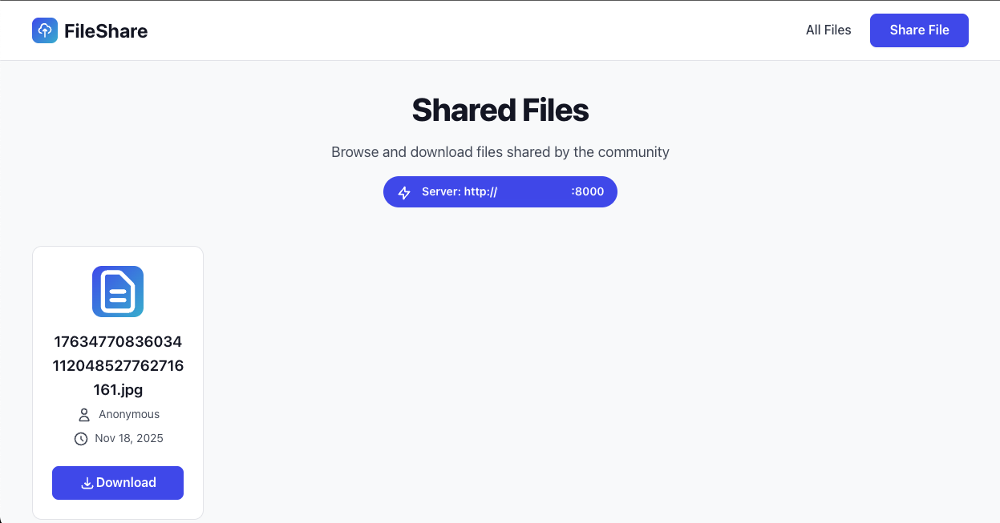
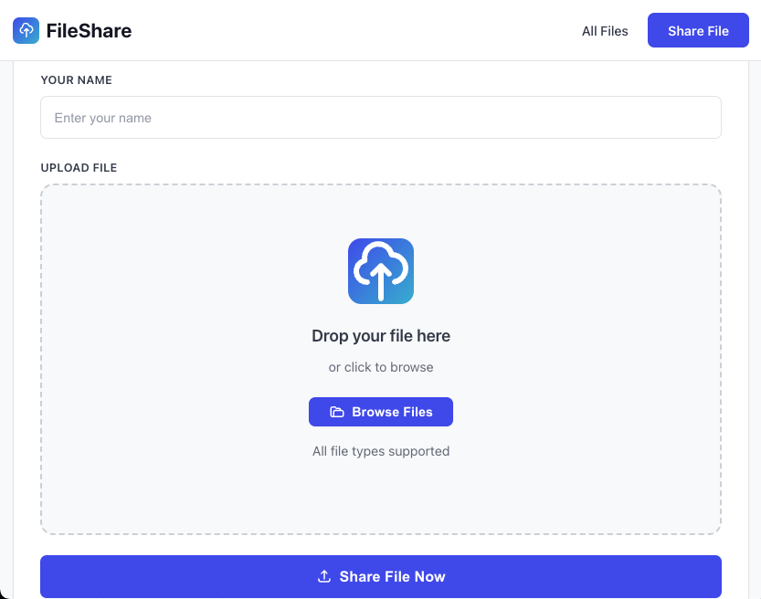
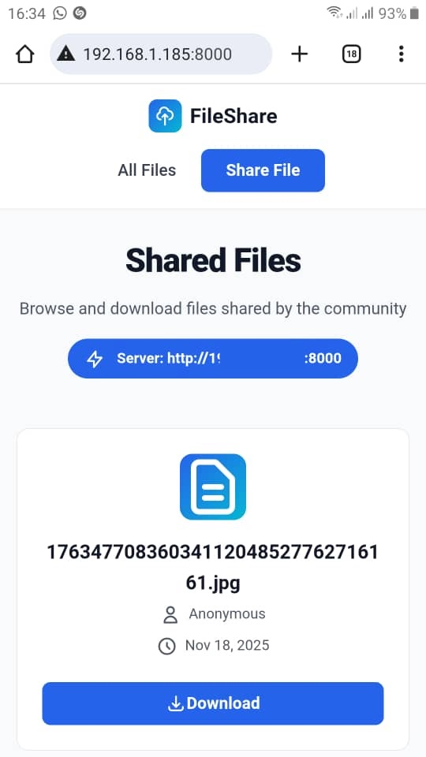
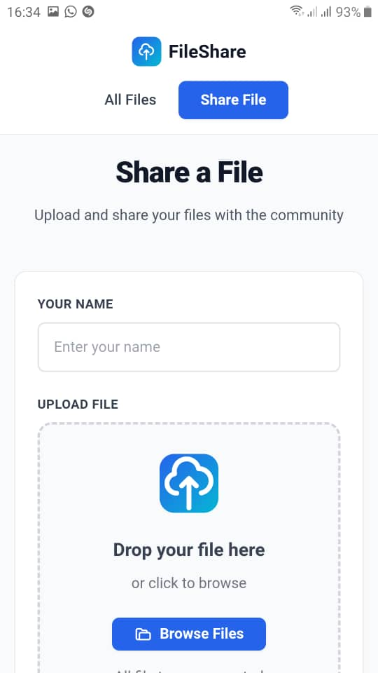

# 📁 FileShare - Local Network File Sharing

A lightweight, secure file sharing application designed to seamlessly transfer files across multiple devices on your local network—**no flash drives or external hard drives needed**. I built this to solve my personal file transfer problems and I hope it helps you too ❤️.


## 🌟 Overview

FileShare is a simple yet powerful solution for sharing files between your devices without the hassle of physical storage media. Whether you need to transfer files between your laptop, desktop, phone, or tablet. It also allows sharing of files across different operating systems (eg: Macos, Windows, Android). FileShare makes it effortless—as long as they're connected to the same local network.

Built with Django and vanilla JavaScript, FileShare provides a clean, minimalist interface that works on any device with a web browser.

## ✨ Key Features

- 🚀 **Fast Local Transfer** - Share files instantly across devices on your network
- 🔒 **Local Network Only** - Files never leave your network, ensuring privacy
- 📱 **Fully Responsive** - Works seamlessly on desktop, tablet, and mobile
- 🎯 **Drag & Drop** - Intuitive file upload with drag-and-drop support
- 🎨 **Clean Interface** - Minimalist design with no clutter
- 💾 **No Size Limits** - Share files of any size (limited only by disk space)
- 🌐 **Cross-Platform** - Access from any device with a web browser
- ⚡ **Zero Configuration** - Simple setup, no complex configuration needed
- 🔌 **Offline Ready** - No external dependencies or internet connection required
- 📦 **All File Types** - Documents, images, videos, archives, and more

## 🔐 Security & Privacy

### Local Network Security

FileShare is designed specifically for **local network use**, which provides several security advantages:

- **🏠 Network Isolation**: Files are only accessible to devices on the same local network (LAN)
- **🚫 No Cloud Storage**: Your files never leave your local network or touch external servers
- **🔒 Private by Design**: No data is sent to third parties or stored externally
- **👁️ Full Control**: You maintain complete control over your files and who can access them
- **🛡️ Network-Level Protection**: Protected by your router's firewall from external access

### Best Practices

For optimal security when using FileShare:

1. **Use on Trusted Networks**: Only run FileShare on your home or trusted private network
2. **Avoid Public WiFi**: Never use on public networks (coffee shops, airports, etc.)
3. **Firewall Protection**: Ensure your router's firewall is enabled
4. **Local Access Only**: By default, the server binds to your local network IP
5. **Temporary Use**: Run the server only when needed, shut it down when done

> **Note**: This application is intended for personal use on trusted local networks. It does not include authentication or encryption features, as it's designed to be used within the security boundary of your home network.

## 📸 Screenshots

### Home Page - File Listing



*Browse and download files shared across your devices*

### Share Page - Upload Files


*Drag and drop files or click to browse*

### Mobile View


*Fully responsive design works on all devices*

### Drag & Drop Upload


*Intuitive drag-and-drop file upload*

## 🚀 Quick Start

### Prerequisites

- Python 3.8 or higher
- pip (Python package manager)

### Installation

1. **Clone the repository**
   ```bash
   git clone https://github.com/AnthonyAniobi/File-Share.git
   cd File-Share
   ```

2. **Create a virtual environment (optional but recomended)**
   ```bash
   python -m venv env
   ```

3. **Activate the virtual environment (optional but recomended)**
   
   On macOS/Linux:
   ```bash
   source env/bin/activate
   ```
   
   On Windows:
   ```bash
   env\Scripts\activate
   ```

4. **Setup the application**
   ```bash
   ./app_setup.sh
   ```

5. **Start the server**
   ```bash
   ./start_app.sh
   ```

6. **Access FileShare**
   On the device hosting the server, access fileshare on `http://0.0.0.0:8000`. On the homepage you would get your access url for all your other devices
   
   Example: `http://192.168.1.100:8000`
   

## 💡 Usage

### Sharing Files

1. Open FileShare on any device connected to your local network
2. Click **"Share File"** in the navigation
3. Enter your name (optional)
4. Drag and drop a file or click to browse
5. Click **"Share File Now"**
6. Your file is now available to all devices on the network!

### Downloading Files

1. Open FileShare on any device
2. Browse the list of shared files
3. Click the **"Download"** button on any file
4. The file will download to your device

### Finding Your Server Address

When you start the server, FileShare automatically displays your local network IP address at the top of the home page. Share this address with your other devices to access FileShare.

Example: `http://192.168.1.100:8000`

## 🛠️ Technical Details

### Built With

- **Backend**: Django 5.2.8
- **Database**: SQLite (included)
- **Frontend**: Vanilla HTML, CSS, JavaScript
- **Styling**: Custom CSS (no frameworks)
- **Icons**: Inline SVG icons

### Project Structure

```
file_share/
├── core/                   # Django project settings
├── file_server/           # Main application
│   ├── templates/         # HTML templates
│   ├── models.py          # Database models
│   ├── views.py           # Application logic
│   └── urls.py            # URL routing
├── static/                # Static assets
│   ├── css/
│   │   └── main.css       # All styles
│   └── js/
│       ├── main.js        # Drag-drop functionality
│       └── icons.js       # SVG icon definitions
├── media/                 # Uploaded files storage
├── db.sqlite3            # Database file
└── manage.py             # Django management script
```

### Features Overview

- **Responsive Grid Layout**: Adapts to any screen size
- **Drag & Drop Upload**: Modern file upload with visual feedback
- **File Preview**: View file details before uploading
- **Real-time Updates**: Files appear immediately after upload
- **No External Dependencies**: All assets are local, works offline
- **Clean URLs**: Simple, intuitive URL structure

## 🔧 Configuration

### Changing the Port

By default, FileShare runs on port 8000. To use a different port:

```bash
python manage.py runserver 0.0.0.0:PORT_NUMBER
```

Example:
```bash
python manage.py runserver 0.0.0.0:3000
```

## 📋 Use Cases

- 📱 Transfer photos from your phone to your computer
- 💼 Share documents between work laptop and personal desktop
- 🎵 Move music files across devices
- 🎬 Transfer videos without slow cloud uploads
- 📄 Quick file sharing during local presentations or meetings
- 🖼️ Share design files between devices without compression
- 📊 Distribute files to multiple devices simultaneously

## ❓ FAQ

**Q: Can I use this over the internet?**  
A: FileShare is designed for local network use only. While it's technically possible to expose it to the internet, it's not recommended as it lacks the necessary security features for public access.

**Q: What file types are supported?**  
A: All file types are supported! Documents, images, videos, archives—anything you can upload.

**Q: Is there a file size limit?**  
A: The only limit is your available disk space. The application itself doesn't impose size restrictions.

**Q: Will files be deleted?**  
A: No, files remain on the server until you manually delete them.

**Q: Can multiple people upload at the same time?**  
A: Yes! FileShare supports multiple simultaneous uploads.

**Q: Do I need an internet connection?**  
A: No! FileShare works entirely on your local network without internet access.

## 🤝 Contributing

Contributions are welcome! If you have suggestions for improvements or bug fixes:

1. Fork the repository
2. Create a feature branch (`git checkout -b feature/amazing-feature`)
3. Commit your changes (`git commit -m 'Add amazing feature'`)
4. Push to the branch (`git push origin feature/amazing-feature`)
5. Open a Pull Request

## 📝 License

This project is open source and available under the [MIT License](LICENSE).

## 👤 Author

**Anthony Aniobi**

- GitHub: [@AnthonyAniobi](https://github.com/AnthonyAniobi)

## 🙏 Acknowledgments

- Built with Django web framework
- Icons from Heroicons (embedded as SVG)
- Inspired by the need for simple, secure local file sharing

## 🐛 Troubleshooting

### Cannot Access Server from Other Devices

- Ensure all devices are on the same network
- Check if your firewall is blocking port 8000
- Verify you're using the correct local IP address
- Try temporarily disabling firewall to test connectivity

### Upload Not Working

- Check available disk space
- Ensure the `media/shared/` directory has write permissions
- Verify file isn't being blocked by antivirus software

### Server Won't Start

- Ensure port 8000 is not already in use
- Check that Python and Django are properly installed
- Verify virtual environment is activated

---

**Made with ❤️ for seamless local file sharing**

*No cloud. No cables. Just simple, secure file sharing on your network.* 
