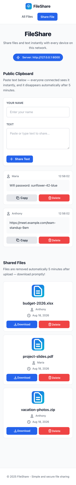
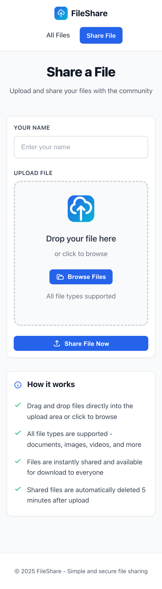

# 📁 FileShare - Local Network File & Text Sharing

A lightweight, secure file and text sharing application designed to seamlessly transfer files — and now text snippets — across every device on your local network, **no flash drives, cables, or cloud accounts needed**. I built this to solve my personal file transfer problems and I hope it helps you too ❤️.


## 🌟 Overview

FileShare turns any laptop or desktop into a tiny, private sharing hub for everyone on the same network. Upload a file from your phone and grab it on your laptop. Paste a Wi-Fi password or a link on one device and watch it appear — live, no refresh — on everyone else's screen. It works across operating systems (macOS, Windows, Linux, Android, iOS) — anything with a web browser can join in.

Built with Flask and vanilla JavaScript, FileShare provides a clean, minimalist interface that's fully responsive from phone to desktop.

## 📸 See It In Action

### 💻 Desktop

<table>
<tr>
<td align="center" width="50%"><b>Home — Public Clipboard &amp; Shared Files</b><br></td>
<td align="center" width="50%"><b>Share a File</b><br></td>
</tr>
</table>

### 📱 Mobile

<table>
<tr>
<td align="center" width="50%"><b>Home</b><br></td>
<td align="center" width="50%"><b>Share a File</b><br></td>
</tr>
</table>

*The exact same interface, gracefully reflowing from a widescreen desktop down to a phone in your pocket.*

## ✨ Key Features

- 🚀 **Fast Local Transfer** - Share files instantly across devices on your network
- 📋 **Public Clipboard** - Paste text and have it appear live on every connected device, ready to copy
- 🙋 **Optional Display Name** - Set a name once per browser tab and it's attached to everything you send; leave it blank and you're just "Anonymous"
- 👀 **Who's Here** - A live sidebar shows everyone currently connected, named or anonymous, updating in real time
- ⚡ **Live Updates** - Files and clipboard text appear and disappear on every screen instantly, no refresh needed
- ⏱️ **Self-Cleaning** - Everything shared automatically disappears 5 minutes later, so nothing piles up
- 🔒 **Local Network Only** - Files never leave your network, ensuring privacy
- 📱 **Fully Responsive** - Works seamlessly on desktop, tablet, and mobile
- 🎯 **Drag & Drop** - Intuitive file upload with drag-and-drop support
- 🎨 **Clean Interface** - Minimalist design with no clutter
- 💾 **No Size Limits** - Share files of any size (limited only by disk space)
- 🌐 **Cross-Platform** - Access from any device with a web browser
- ⚡ **Zero Configuration** - Simple setup, no complex configuration needed
- 🔌 **Offline Ready** - No external dependencies or internet connection required
- 📦 **All File Types** - Documents, images, videos, archives, and more

## 🚀 Quick Start

### Prerequisites

- Python 3.8 or higher
- pip (Python package manager)

### Installation

1. **Clone the repository**
   ```bash
   git clone https://github.com/AnthonyAniobi/File-Share.git
   cd File-Share
   ```

2. **Create a virtual environment (optional but recomended)**
   ```bash
   python -m venv env
   ```

3. **Activate the virtual environment (optional but recomended)**
   
   On macOS/Linux:
   ```bash
   source env/bin/activate
   ```
   
   On Windows:
   ```bash
   env\Scripts\activate
   ```

4. **Setup the application**
   ```bash
   ./app_setup.sh
   ```

5. **Start the server**
   ```bash
   ./start_app.sh
   ```

6. **Open FileShare**

   On the device hosting the server, visit `http://localhost:8000`. The homepage displays your local network address (e.g. `http://192.168.1.100:8000`) — that's the address every other device on the network should use.

   An admin panel is also available at `/admin/` for searching, editing uploader names, or deleting shared file and clipboard records.

## 📖 How to Use

### 1. Find your server address

Once the server is running, open it on the hosting device. The blue pill near the top of the home page shows your server's local network address (e.g. `http://192.168.1.100:8000`) — that's what you'll type into every other device's browser to join in.

### 2. (Optional) Set your display name

At the top of every page there's a **Your name** field. Whatever you type there is attached to every file and clipboard entry you send from that browser tab — no need to re-enter it each time. Leave it blank and everything you send goes out as **Anonymous**. It's remembered only for as long as that browser tab stays open; close the tab and it's gone.

### 3. See who's online

Click the **online** tab on the right edge of the screen to open the "Who's here" sidebar — a live list of everyone currently connected, showing their display name (or "Anonymous"). It updates instantly as people join, rename themselves, or close their tab.

### 4. Share a file

1. Click **"Share File"** in the navigation
2. Drag and drop a file onto the upload area, or click to browse
3. Click **"Share File Now"**
4. Your file instantly appears in **Shared Files** on every connected device, credited to your display name (or "Anonymous")

### 5. Download a file

1. Open FileShare on any device on the network
2. Find the file in the **Shared Files** grid
3. Click **"Download"**

### 6. Use the Public Clipboard

1. On the home page, type or paste text into the **Public Clipboard** box
2. Click **"Share Text"**
3. It appears instantly on every other connected device — no refresh needed
4. Anyone can click **"Copy"** to copy it straight to their own clipboard

### 7. Clean up early (optional)

Click **"Delete"** on any file or clipboard entry to remove it immediately for everyone. If you don't, it's removed automatically anyway — see below.

### 8. Let things clean themselves up

Every file and every clipboard entry is automatically deleted **5 minutes** after it's shared, so the server never accumulates old data. There's nothing to do — just re-share something if it's needed longer.

## 🔐 Security & Privacy

### Local Network Security

FileShare is designed specifically for **local network use**, which provides several security advantages:

- **🏠 Network Isolation**: Files are only accessible to devices on the same local network (LAN)
- **🚫 No Cloud Storage**: Your files never leave your local network or touch external servers
- **🔒 Private by Design**: No data is sent to third parties or stored externally
- **👁️ Full Control**: You maintain complete control over your files and who can access them
- **🛡️ Network-Level Protection**: Protected by your router's firewall from external access

### Best Practices

For optimal security when using FileShare:

1. **Use on Trusted Networks**: Only run FileShare on your home or trusted private network
2. **Avoid Public WiFi**: Never use on public networks (coffee shops, airports, etc.)
3. **Firewall Protection**: Ensure your router's firewall is enabled
4. **Local Access Only**: By default, the server binds to your local network IP
5. **Temporary Use**: Run the server only when needed, shut it down when done

> **Note**: This application is intended for personal use on trusted local networks. It does not include authentication or encryption features, as it's designed to be used within the security boundary of your home network.

## 🛠️ Technical Details

### Built With

- **Backend**: Flask 3.0
- **Database**: SQLite via SQLAlchemy + Flask-Migrate (included)
- **Live Updates**: Server-Sent Events (no external message broker needed)
- **Admin Panel**: Flask-Admin
- **Frontend**: Vanilla HTML, CSS, JavaScript
- **Styling**: Custom, responsive CSS (no frameworks)
- **Icons**: Inline SVG icons

### Project Structure

```
file_share/
├── app/                          # Application package
│   ├── file_server/              # Routes (home, share, delete, media, clipboard, live updates)
│   ├── templates/                # HTML templates
│   ├── static/
│   │   ├── css/main.css          # All styles (responsive by default)
│   │   └── js/
│   │       ├── main.js           # Drag-drop functionality
│   │       ├── realtime.js       # Live updates, profile, presence sidebar, clipboard copy (SSE)
│   │       └── icons.js          # SVG icon definitions
│   ├── models.py                 # Database models (files + clipboard entries)
│   ├── cleanup.py                # Background job that expires old files/text
│   ├── events.py                 # Pub/sub used to push live updates to browsers
│   ├── presence.py               # In-memory "who's online" registry (not persisted)
│   ├── admin.py                  # Flask-Admin configuration
│   ├── config.py                 # Environment configuration
│   └── extensions.py             # Flask extension instances
├── migrations/                   # Database migrations (Flask-Migrate/Alembic)
├── media/                        # Uploaded files storage
├── tests/                        # Test suite (pytest)
├── db.sqlite3                    # Database file
└── wsgi.py                       # Application entry point
```

### Features Overview

- **Responsive Layout**: Adapts to any screen size, from phones to widescreens
- **Drag & Drop Upload**: Modern file upload with visual feedback
- **File Preview**: View file details before uploading
- **Real-Time Updates**: Files and clipboard text appear/disappear on every screen instantly via Server-Sent Events
- **Automatic Expiry**: Everything shared is cleaned up 5 minutes after it's posted
- **No External Dependencies**: All assets are local, works offline
- **Clean URLs**: Simple, intuitive URL structure

## 🔧 Configuration

FileShare works out of the box with zero configuration, but a few things can be tuned via environment variables (see `.env.example`):

| Variable | Default | Description |
|---|---|---|
| `SECRET_KEY` | *(dev key)* | Flask session/CSRF signing key — set a real value in production |
| `DATABASE_URL` | local `db.sqlite3` | Database connection string |
| `FILE_EXPIRY_SECONDS` | `300` (5 min) | How long a shared file lives before auto-deletion |
| `CLIPBOARD_EXPIRY_SECONDS` | `300` (5 min) | How long a clipboard entry lives before auto-deletion |
| `CLEANUP_INTERVAL_SECONDS` | `30` | How often the server checks for expired items |

### Changing the Port

By default, FileShare runs on port 8000. To use a different port, edit the port passed to `app.run()` in [wsgi.py](wsgi.py), or run it directly with Flask's CLI:

```bash
flask run --host 0.0.0.0 --port PORT_NUMBER
```

Example:
```bash
flask run --host 0.0.0.0 --port 3000
```

## 📋 Use Cases

- 📱 Transfer photos from your phone to your computer
- 💼 Share documents between work laptop and personal desktop
- 🎵 Move music files across devices
- 🎬 Transfer videos without slow cloud uploads
- 📄 Quick file sharing during local presentations or meetings
- 🖼️ Share design files between devices without compression
- 📊 Distribute files to multiple devices simultaneously
- 🔑 Pass along a Wi-Fi password or meeting link via the Public Clipboard without spelling it out loud

## ❓ FAQ

**Q: Can I use this over the internet?**  
A: FileShare is designed for local network use only. While it's technically possible to expose it to the internet, it's not recommended as it lacks the necessary security features for public access.

**Q: What file types are supported?**  
A: All file types are supported! Documents, images, videos, archives—anything you can upload.

**Q: Is there a file size limit?**  
A: The only limit is your available disk space. The application itself doesn't impose size restrictions.

**Q: Will files be deleted?**  
A: Yes. Files are automatically deleted 5 minutes after upload (configurable via the `FILE_EXPIRY_SECONDS` environment variable) so the server doesn't accumulate old files. You can also delete a file manually at any time before then.

**Q: Can multiple people upload at the same time?**  
A: Yes! FileShare supports multiple simultaneous uploads.

**Q: How long does clipboard text stick around?**  
A: 5 minutes after it's pasted (configurable via the `CLIPBOARD_EXPIRY_SECONDS` environment variable), or until someone deletes it manually.

**Q: Do other devices need to refresh the page to see new files or text?**  
A: No. The home page holds a live connection to the server, so new files, new clipboard text, deletions, and expirations all show up instantly on every open tab.

**Q: Does my display name get saved anywhere?**  
A: No. It only lives in that browser tab for as long as the tab is open — nothing is written to a database, and there's no account or login. Close the tab and it's gone; open a new one and you start as Anonymous again.

**Q: Does the "who's online" list persist across server restarts?**  
A: No. It only reflects who's actively connected right now, so restarting the server always starts with an empty list.

**Q: Do I need an internet connection?**  
A: No! FileShare works entirely on your local network without internet access.

## 🤝 Contributing

Contributions are welcome! If you have suggestions for improvements or bug fixes:

1. Fork the repository
2. Create a feature branch (`git checkout -b feature/amazing-feature`)
3. Commit your changes (`git commit -m 'Add amazing feature'`)
4. Push to the branch (`git push origin feature/amazing-feature`)
5. Open a Pull Request

## 📝 License

This project is open source and available under the [MIT License](LICENSE).

## 👤 Author

**Anthony Aniobi**

- GitHub: [@AnthonyAniobi](https://github.com/AnthonyAniobi)

## 🙏 Acknowledgments

- Built with Flask web framework
- Icons from Heroicons (embedded as SVG)
- Inspired by the need for simple, secure local file sharing

## 🐛 Troubleshooting

### Cannot Access Server from Other Devices

- Ensure all devices are on the same network
- Check if your firewall is blocking port 8000
- Verify you're using the correct local IP address
- Try temporarily disabling firewall to test connectivity

### Upload Not Working

- Check available disk space
- Ensure the `media/shared/` directory has write permissions
- Verify file isn't being blocked by antivirus software

### Files or Clipboard Text Not Updating Live

- Make sure JavaScript is enabled in your browser
- Some corporate/hotel networks proxy or buffer long-lived connections, which can delay live updates — refresh the page as a fallback
- Check the browser console for errors and confirm the page can reach `/events/stream` on the server

### Server Won't Start

- Ensure port 8000 is not already in use
- Check that Python and Flask are properly installed
- Verify virtual environment is activated

---

**Made with ❤️ for seamless local file sharing**

*No cloud. No cables. Just simple, secure file and text sharing on your network.*
